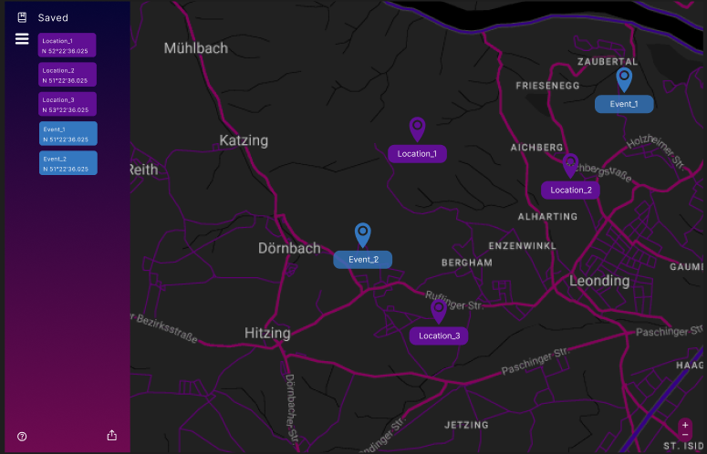
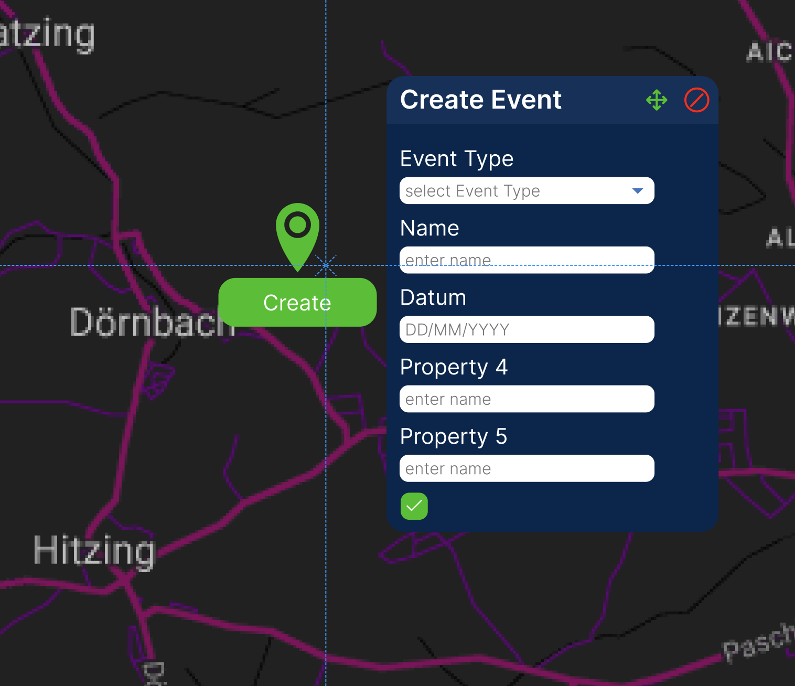
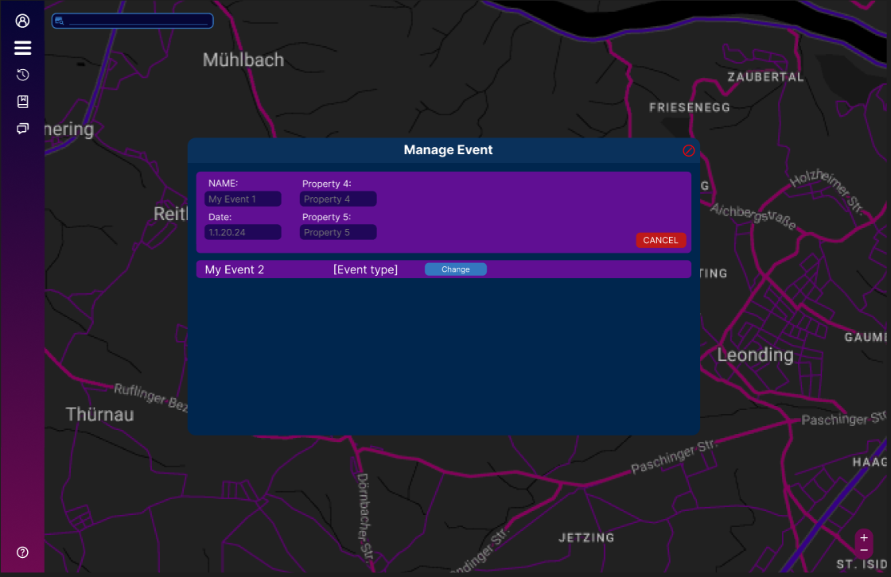
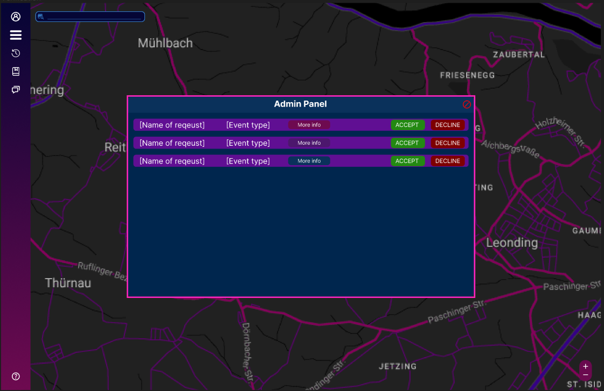
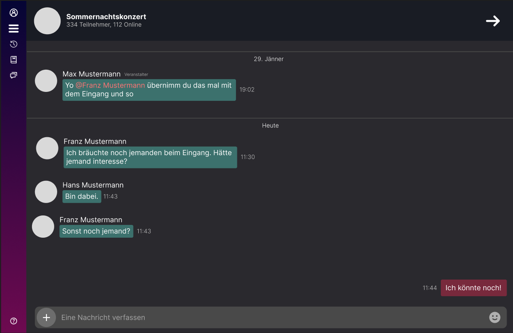

# Projektantrag - Hotvite
Lisa Wieshofer, Leo Oberndorfer, Moritz Bernhofer

# 1. Ausgangslage

### 1.1. Ist-Situation
> Zurzeit gibt es keine App, um Veranstaltungen im Freundeskreis oder Umfeld zu finden oder zu erstellen. Bis jetzt muss man Veranstaltung über Webseiten/TV/Radio ankündigen und Partys jeden einzelnen oder in einer Gruppe fragen.

### 1.2. Verbesserungspotenziale
> Da so eine App nicht existiert, ist es für manche Menschen schwer Veranstaltungen schnell und effizient zu finden.

# 2. Zielsetzung
> Wir wollen eine Plattform schaffen, die es jedem ermöglicht, ein Publikum zu finden, mit dem man die Zeit verbringen möchte. Aktuell müssen Veranstalter ihre Events online auf einer Website bekannt geben, Plakate aufhängen oder anderen Leuten davon berichten.

> Unsere App soll eine übersichtliche Karte von Orten in der Umgebung anzeigen, an denen Veranstaltungen stattfinden. Der Benutzer kann sich die Veranstaltungen in seiner Nähe anzeigen lassen und sich für diese anmelden. Er kann auch selber eine Veranstaltung erstellen und diese mit anderen teilen. Potenzielle Teilnehmer können sich auf Knopfdruck für Veranstaltungen anmelden und werden automatisch benachrichtigt, wenn sich etwas an der Veranstaltung ändert. Der Veranstalter kann die Teilnehmerzahl begrenzen und die Teilnehmerliste einsehen.

# 3. Funktionale Anforderungen
### 3.1. Use Case Überblick

### 3.2. Events
#### 3.2.1 GUI-Design
> 

#### 3.2.2 Workflow Restricted Events
> Restricted Events sind Events, die jeder mit einem Login erstellen kann. Diese Events können nur Leute sehen, die eingeloggt und mit der Person, die es erstellt hat, folgen oder eine Einladung von der Person bekommen. Teilnehmer können hier auch direkt angeben, ob sie kommen oder nicht.

#### 3.2.3 Workflow Public Events
> Public Events können nur von verifizierte Accounts erstellt werden. Jeder kann diese Events sehen, egal ob eingeloggte oder nicht. Wenn es sich um ein Event handelt, für das Tickets erforderlich sind, wird der Benutzer über einen Link zur Website weitergeleitet, auf der die Tickets verkauft werden.

### 3.3. Event erstellen
#### 3.3.1 GUI-Design
> 

#### 3.3.2 Workflow
> Events kann man nur erstellen, wenn man eingeloggt ist. Bei der Erstellung müssen der Name, das Datum/Uhrzeit und die Art des Events angegeben werden. Es besteht auch die Möglichkeit, eine Beschreibung und Anforderungen(Bsp. Mindestalter) hinzuzufügen. Falls zutreffend, kann auch der Eintrittspreis angezeigt werden.

### 3.4. Verwaltung
#### 3.4.1 GUI-Design
> 

#### 3.4.2 Workflow
> Admins können neben den Veranstalter Events auch verwalten und löschen, wenn sie gegen die Nutzungsbedingungen verstoßen.

### 3.5. Verifikation
#### 3.5.1 GUI-Design
> 

#### 3.5.2 Workflow
> Veranstaltungsfirmen können eine Verifikationsanfrage stellen, die ein Admin genehmigen müssen, bevor der Account verifiziert wird. Die Verifikation ist dazu da, dass nicht jeder beliebig öffentliche Events erstellen kann, um Leute davon abzuhalten falsche Events zu erstellen. 

### 3.6. Chat
#### 3.6.1 GUI-Design
> 

#### 3.6.2 Workflow
> Der, der ein Event erstellt kann auch einstellen, ob es eine Chatfunktion für dieses Event geben soll.