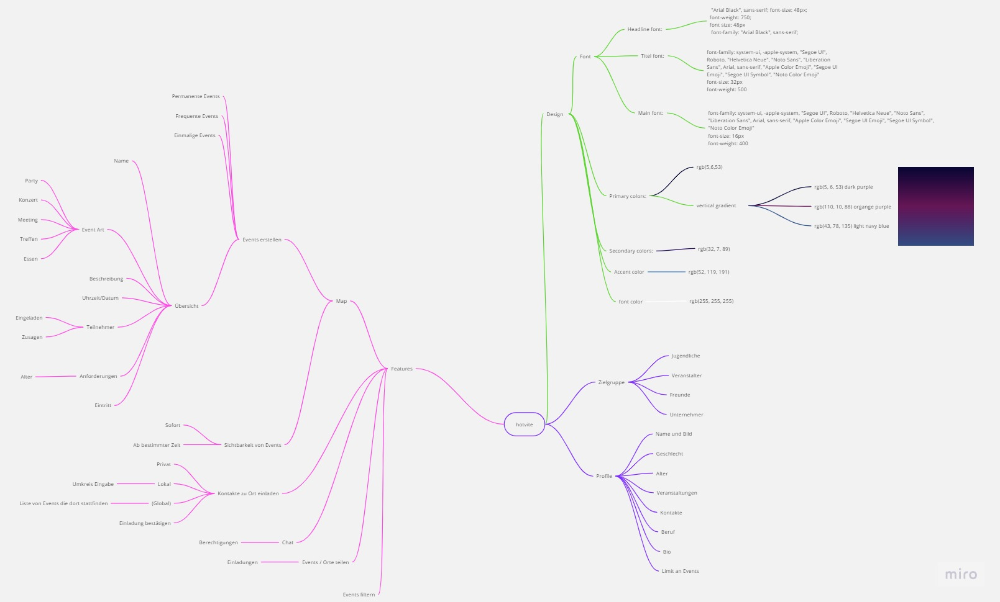
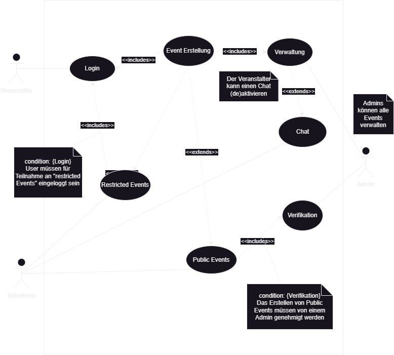

# Projektantrag - Hotvite
Lisa Wieshofer, Leo Oberndorfer, Moritz Bernhofer

# 1. Ausgangslage

### 1.1. Ist-Situation
> Zurzeit gibt es keine App, um Veranstaltungen im Freundeskreis oder Umfeld zu finden oder zu erstellen. Bis jetzt muss man Veranstaltung über Webseiten/TV/Radio ankündigen und Partys jeden einzelnen oder in einer Gruppe fragen.

### 1.2. Verbesserungspotenziale
> Da so eine App nicht existiert, ist es für manche Menschen schwer Veranstaltungen schnell und effizient zu finden.

# 2. Zielsetzung
> Wir wollen eine Plattform schaffen, die es jedem ermöglicht, ein Publikum zu finden, mit dem man die Zeit verbringen möchte. Aktuell müssen Veranstalter ihre Events online auf einer Website bekannt geben, Plakate aufhängen oder anderen Leuten davon berichten.

> Unsere App soll eine übersichtliche Karte von Orten in der Umgebung anzeigen, an denen Veranstaltungen stattfinden. Der Benutzer kann sich die Veranstaltungen in seiner Nähe anzeigen lassen und sich für diese anmelden. Er kann auch selber eine Veranstaltung erstellen und diese mit anderen teilen. Potenzielle Teilnehmer können sich auf Knopfdruck für Veranstaltungen anmelden und werden automatisch benachrichtigt, wenn sich etwas an der Veranstaltung ändert. Der Veranstalter kann die Teilnehmerzahl begrenzen und die Teilnehmerliste einsehen.

# 3. Funktionale Anforderungen
### 3.1. Use Case Überblick

### 3.2. Restricted Events
#### 3.2.1 GUI-Design
> 

#### 3.2.2 Workflow
> Restricted Events sind Events, die jeder mit einen Login erstellen kann. Diese Events können nur Leute sehen, die eingeloggt und mit der Person, die es erstellt hat, folgen.

### 3.3. Public Events
#### 3.3.1 GUI-Design
>

#### 3.3.2 Workflow
> Public Events können nur verifizierte Accounts erstellen. Jeder kann diese Events sehen.

### 3.4. Event erstellen
#### 3.4.1 GUI-Design
> 

#### 3.4.2 Workflow
> Events kann man nur erstellen wenn man eingeloggt ist. Beim Eventerstellen muss man den Namen und das Datum/Uhrzeit des Events angeben. Man kann auch eine Beschreibung und Anforderungen(Bsp. Alter) hinzufügen. Wenn es wäre kann man auch den Eintritt anzeigen.

### 3.5. Verwaltung
#### 3.5.1 GUI-Design
> 

#### 3.5.2 Workflow
> Admins können neben den Veranstalter Events auch verwalten und löschen.

### 3.6. Verifikation
#### 3.6.1 GUI-Design
> 

#### 3.6.2 Workflow
> Veranstaltungsfirmen können eine Verifikationsanfrage stellen, die ein Admin genehmigen müssen, bevor der Account verifiziert wird. 

### 3.7. Chat
#### 3.7.1 GUI-Design
> 

#### 3.7.2 Workflow
> Der, der ein Event erstellt kann auch einstellen, ob es eine Chatfunktion für dieses Event geben soll.

# 4. Anforderung
### 4.1. Anforderungen an die Applikationssoftware
> Die Applikation muss dem Benutzer die Möglichkeit bieten, Veranstaltungen zu erstellen, zu bearbeiten und zu löschen.

### 4.2. Anforderungen an die Systemplattform
> Geplant hier ist das wir uns einen suchen Server. Zurzeit ist aber noch keiner vorhanden.

### 4.3. Anbieter bezogene Anforderungen
> Ein Support-Service muss rund um die Uhr verfügbar sein, um Probleme zeitnah zu beheben.

# 5. Mengengerüst
> - Datenbewegungen: > 10MB 
> - Verfügbarer Server Speicher: > 200GB 
> - Anzahl der maximalen gleichzeitiger Benutzer: > 100-200 Benutzer 

# 6. Aufbau und Inhalte der Offerte
> - Wir wollen (Leo Oberndorfer, Lisa Wieshofer, Moritz Bernhofer) eine 1 auf das Projekt. Das ist unser Angebot. Für die Plannung eine 1. Für die kommende Implementierung 1.
> - Management Summary
> - Beschreibung der angebotenen Leistungen entsprechend der Gliederung der Kapitel „Zielsetzung" und „Anforderungen"

# 7. Administratives
> - Die Rechte des Projektes gehen an Leo Oberndorfer, Lisa Wieshofer und Moritz Bernhofer
> - Evaluationsschwerpunkte
> - Verteiler
> - Wir haben kein Budge.
> - Rückfragen zum Pflichtenheft
> - Das Projekt wird zum Ende des zweiten Semesters fertig gestellt
> - Eine 1 auf das Projekt in WMC und SYP.
