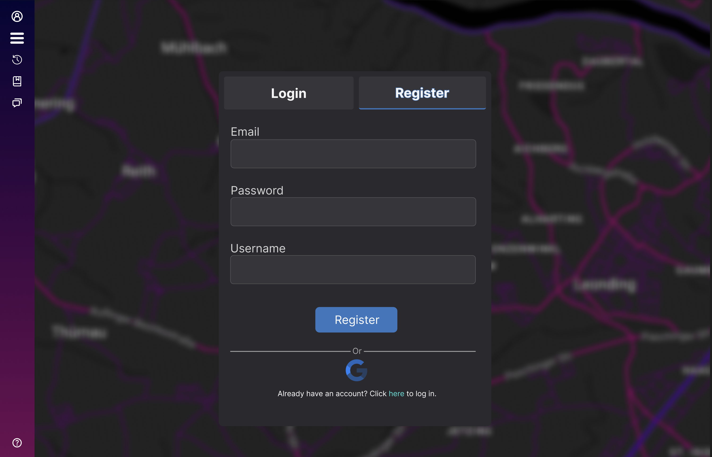
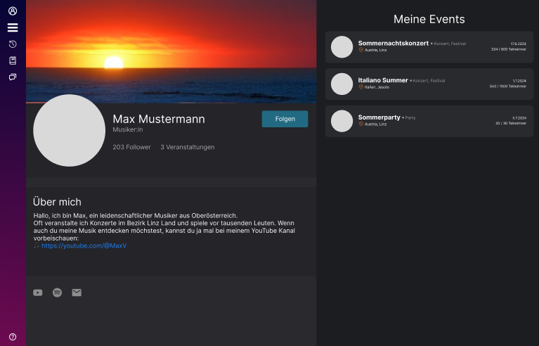

# Projektantrag - Hotvite
Lisa Wieshofer, Leo Oberndorfer, Moritz Bernhofer

# 1. Ausgangslage

### 1.1. Ist-Situation
> Zurzeit gibt es keine App, um Veranstaltungen im Freundeskreis oder Umfeld zu finden oder zu erstellen. Bis jetzt muss man Veranstaltung über Webseiten/TV/Radio ankündigen und Partys jeden einzelnen oder in einer Gruppe fragen.

### 1.2. Verbesserungspotenziale
> Da so eine App nicht existiert, ist es für manche Menschen schwer Veranstaltungen schnell und effizient zu finden.

# 2. Zielsetzung
> Wir wollen eine Plattform schaffen, die es jedem ermöglicht, ein Publikum zu finden, mit dem man die Zeit verbringen möchte. Aktuell müssen Veranstalter ihre Events online auf einer Website bekannt geben, Plakate aufhängen oder anderen Leuten davon berichten.

> Unsere App soll eine übersichtliche Karte von Orten in der Umgebung anzeigen, an denen Veranstaltungen stattfinden. Der Benutzer kann sich die Veranstaltungen in seiner Nähe anzeigen lassen und sich für diese anmelden. Er kann auch selber eine Veranstaltung erstellen und diese mit anderen teilen. Potenzielle Teilnehmer können sich auf Knopfdruck für Veranstaltungen anmelden und werden automatisch benachrichtigt, wenn sich etwas an der Veranstaltung ändert. Der Veranstalter kann die Teilnehmerzahl begrenzen und die Teilnehmerliste einsehen.

# 3. Funktionale Anforderungen
### 3.1. Use Case Überblick
> 

## 3.2 Welcome Screen
#### 3.2.1 GUI-Design
> 

#### 3.2.2 Workflow
> Wenn ein User das erste Mal auf die Seite zugreift, bekommt er ein Popup mit einer kurzen Einführung bzw. den Möglichkeiten, die ihm auf unserer Seite zur Verfügung stehen. Startklar ist er, sobald er entweder auf den Button "Let's start" oder auf das X klickt. Danach wird er auf die Karte weitergeleitet. 

### 3.2.3 View Events
#### 3.2.3.1 GUI-Design
> 

#### 3.2.3.2 Workflow
> Diese Ansicht ist die Hauptansicht der Seite. Der User sieht eine Karte, auf der alle Events in seiner Nähe angezeigt werden. Ausgangspunkt der Karte ist der Standort des Users. Sie kann jedoch beliebig verschoben werden. Events, die außerhalb des fokussierten Bereiches liegen, werden erst dann geladen, sobald man die Karte dementsprechend verschiebt. Das selbe umgekehrt: Events, die aus dem Fokus geschoben werden, werden vom Frontend entfernt, um Resourcen zu sparen. Die Events sind mit einem Marker auf der Karte gekennzeichnet und Events, die im Fokus sind, haben deren Titel zusätlich in einer floating box über dem Marker. Events sind dann im Fokus, wenn sie von der Mitte der Ansicht aus die Hälfte des Abstandes zum Seitenrand nicht überschreiten. Ist jedoch nicht genug Platz für die floating box (evtl. aufgrund von zu vielen Events in der Nähe und dem Zoom Level), wird die floating box nicht (mehr) angezeigt.

## 3.3. View Event
Wir unterscheiden zwischen 4 Ansichten: Gast, Angemeldeter User, Teilnehmer und Veranstalter. Die Ansichten unterscheiden sich grundsätzlich nur in den Interaktionsmöglichkeiten. In jeder Ansicht sind die Details des Events zu sehen. Außerdem wird links zusätzlich das Profil des Veranstalters angezeigt.
### 3.3.1 Guest View
#### 3.3.1.1 Guest GUI-Design
> 

#### 3.3.1.2 Workflow
> Als nicht-angemeldeter User kann man zwar Details des Events sehen, jedoch nicht teilnehmen. Anstatt einem Knopf, um am Event teilzunehmen, gibt es einen Knopf, der den User zur Anmeldung leitet. Der Chat ist für nicht-angemeldete User nicht bedienbar.

### 3.3.2 Logged In User View
#### 3.3.2.1 Logged In User GUI-Design
> 

#### 3.3.2.2 Workflow
> Als angemeldeter User kann man am Event durch den "Bin dabei" Knopf teilnehmen oder sich das Event mit dem "Interessiert" Knopf für später speichern. Der Chat ist für angemeldete User noch nicht bedienbar.

### 3.3.3 Participant View
#### 3.3.3.1 Workflow
> Als Teilnehmer habe ich nur die Möglichkeit, das Event zu verlassen. Ansicht bis auf Knöpfe gleich wie bei "Logged In User View". Der Chat ist für Teilnehmer bedienbar. Teilnehmer sind für andere User unter der Teilnehmerliste sichtbar.

### 3.3.4 Host View
#### 3.3.4.1 Workflow
> Als Veranstalter habe ich nur die Möglichkeit, das Event zu verwalten. Ansicht bis auf Knöpfe gleich wie bei "Logged In User View". Der Chat ist für Veranstalter bedienbar. Veranstalter sind nicht in der Teilnehmerliste.

## 3.4 Create Event
### 3.4.1 Location Select
#### 3.4.1.1 Location Select GUI-Design
> 

#### 3.4.1.2 Location Selection
> User können auf der Karte den gewünschten Ort mit recht-Klick auswählen und auf "Hier erstellen" drücken.

### 3.4.2 Define Details
#### 3.4.2.1 GUI-Design
> 

#### 3.4.2.2 Workflow
> Nach dem wählen des Ortes können Veranstlater Details für ihr Event festlegen. Titel und Beschreibung sind Texteingaben mit einer gegebenen, maximal erlaubten Länge. Beginn und Ende kann man über eine Kalender- und Zeitauswahl festlegen. Ob und wie viel Eintritt zu zahlen ist, kann man durch ein Zahlinput angeben. Wo dieser zu zahlen ist durch ein weiteres Dropdown rechts daneben. Die Adresse wird automatisch vom gewählten Ort übernommen, kann jedoch geändert werden (Texteingabe). Der Typ des Events kann aus einer vorgegebenen Liste ausgewählt werden. Die maximale Teilnehmeranzahl ist eine Zahleneingabe. Sobald diese erreicht ist, können keine weiteren Teilnehmer mehr am Event teilnehmen. Die Teilnehmerliste ist auch für den Veranstalter einsehbar. Der Veranstalter kann auch eigene Teilnahmebedingungen festlegen, die er aber selber vor Ort überprüfen muss. Ob für das Event ein Chat verfügbar ist oder nicht, kann er auch entscheiden. Zum Schluss kann er das Event erstellen oder verwerfen. Beim Verwerfen wird er gefragt, ob er das Event wirklich verwerfen will (Das selbe durch das Drücken auf das X rechts oben). Wenn er das Event erstellt, wird er zurück auf die Karte geleitet und das Event wird auf der Karte angezeigt.

## 3.5. Edit Event
### 3.5.1 GUI-Design
> 

### 3.5.2 Workflow
> Ähnlich wie bei "Create Event" kann der Veranstalter die Details des Events bearbeiten. Der einzige Unterschied ist, dass die Details schon vorgegeben sind. Der Veranstalter kann die Details bearbeiten und das Event speichern, die Änderungen verwerfen oder das Event löschen. Beim Verwerfen oder Löschen wird eine Bestätigung verlangt. Wenn er das Event speichert, wird er zurück auf die Karte geleitet.

## 3.6 Event Chat
#### 3.6.1 GUI-Design
> 

#### 3.6.2 Workflow
> Wurde der Chat vom Veranstalter aktiviert, können alle Teilnehmer des Events miteinander kommunizieren und Dateien teilen. Der Chat ist nur für Teilnehmer und Veranstalter bedienbar. Er läuft in Echtzeit und wird automatisch aktualisiert. Inhalte werden nach dem Event mit dem Event gelöscht. Der Chat und seine Inhalte sind nur für das entsprechende Event verfügbar und nicht für andere Events. Durch den Pfeil rechts oben gelangt man zurück zur Detailübersicht des Events.

## 3.7 Profile
### 3.7.1 Login & Register
#### 3.7.1.1 Login & Register GUI-Design

#### 3.7.1.2 Workflow
> User können sich mit ihrer E-Mail und Passwort anmelden oder sich neu registrieren. Bei der Registrierung kann der User einen Namen wählen. Außerdem wird die gegebene E-Mail auf ihre Gültigkeit überprüft und das Passwort auf seine Sicherheit. Die Anmeldung / Registrierung mit Google ist auch möglich. Nach dem erfolgreichen Anmelden oder Registrieren wird der User auf die Karte weitergeleitet.

### 3.7.2 My Profile
#### 3.7.2.1 GUI-Design

#### 3.7.2.2 Workflow
> Der User kann sein Profil bearbeiten und sich ausloggen. Er kann seinen Namen, seine E-Mail, sein Passwort, sein Profilbild, das Banner, seine "Über mich" Sektion und seine social links bearbeiten. Das Profilbild wird in einem Kreis angezeigt. Der User kann auch seine Events einsehen und verwalten. Er kann auch die Events, an denen er teilnimmt, einsehen. Durch das Drücken auf das Event wird er auf die Detailansicht des Events weitergeleitet.

### 3.7.3 Other Profiles
#### 3.7.3.1 GUI-Design

#### 3.7.3.2
> Anders als bei "My Profile" kann der User hier nur die Events des anderen Users einsehen. Durch das Drücken auf das Event wird er auf die Detailansicht des Events weitergeleitet. Teilnahmen sind nicht einsehbar.

## 3.8. Saved Events
### 3.8.1 GUI-Design

### 3.8.2 Workflow
> Durch das Drücken des "Interessiert" Knopfes bei einem Event wird das Event in die "Gespeicherte Events" Liste des Users hinzugefügt, wo er sich später entscheiden kann, ob er dabei ist oder das Event verwerfen möchte. Durch das Drücken auf das gespeicherte Event wird er auf die Detailansicht des Events weitergeleitet. Auch dort kann der User das Event wieder aus der Liste entfernen oder beitreten. Tretet man einem Event bei wird es automatisch aus der Liste entfernt. Durch den Knopf "Finde weitere Events in deiner Nähe" gelangt der User zurück auf die Karte.

## 3.9. Notifications
#### 3.8.1 Workflow
> Wenn ein User sich für ein Event anmeldet, wird er benachrichtigt, wenn sich etwas an dem Event ändert. Das kann z.B. sein, dass das Event abgesagt wurde, dass das Event beginnt oder dass das Event voll ist. Der User wird auch benachrichtigt, wenn er eine Nachricht im Chat bekommt.