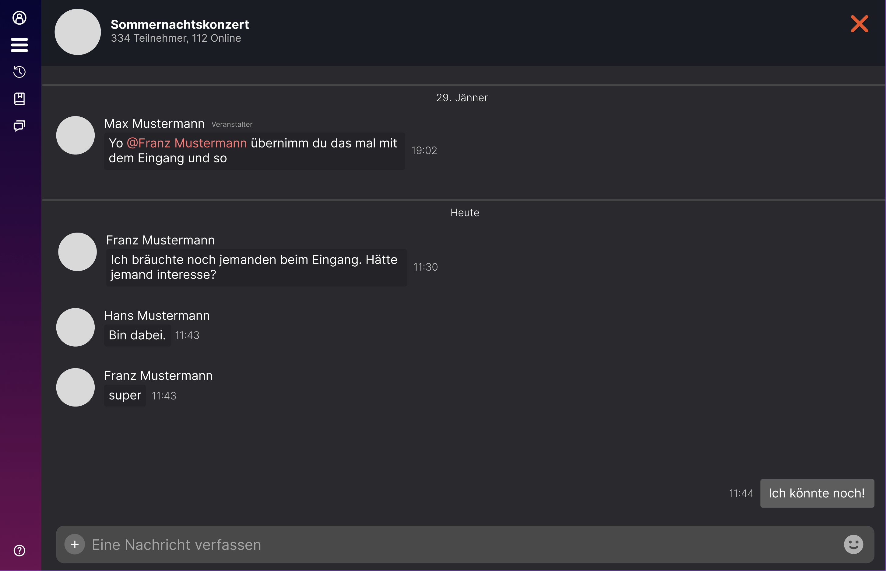

# Projektantrag - Hotvite
Lisa Wieshofer, Leo Oberndorfer, Moritz Bernhofer

# 1. Ausgangslage

### 1.1. Ist-Situation
> Zurzeit gibt es keine App, um Veranstaltungen im Freundeskreis oder Umfeld zu finden oder zu erstellen. Bis jetzt muss man Veranstaltung über Webseiten/TV/Radio ankündigen und Partys jeden einzelnen oder in einer Gruppe fragen.

### 1.2. Verbesserungspotenziale
> Da so eine App nicht existiert, ist es für manche Menschen schwer Veranstaltungen schnell und effizient zu finden.

# 2. Zielsetzung
> Wir wollen eine Plattform schaffen, die es jedem ermöglicht, ein Publikum zu finden, mit dem man die Zeit verbringen möchte. Aktuell müssen Veranstalter ihre Events online auf einer Website bekannt geben, Plakate aufhängen oder anderen Leuten davon berichten.

> Unsere App soll eine übersichtliche Karte von Orten in der Umgebung anzeigen, an denen Veranstaltungen stattfinden. Der Benutzer kann sich die Veranstaltungen in seiner Nähe anzeigen lassen und sich für diese anmelden. Er kann auch selber eine Veranstaltung erstellen und diese mit anderen teilen. Potenzielle Teilnehmer können sich auf Knopfdruck für Veranstaltungen anmelden und werden automatisch benachrichtigt, wenn sich etwas an der Veranstaltung ändert. Der Veranstalter kann die Teilnehmerzahl begrenzen und die Teilnehmerliste einsehen.

# 3. Funktionale Anforderungen
### 3.1. Use Case Überblick
> 

## 3.2. Manage profile
#### 3.2.1 GUI-Design
> 

#### 3.2.2 Workflow
> Nach dem Einloggen kann das Profil angepasst werden, indem man auf sein Profil geht, auf "Bearbeiten" klickt und dann anschließend nach Belieben seinen Namen, die Beschreibung und sein Profilbild ändern. Zusätzlich kann man auch seine Sozial-Media verlinken.

## 3.3. Creat Event
#### 3.3.1 GUI-Design
> 

#### 3.3.2 Workflow
> Events können nur erstellt werden, wenn man angemeldet ist. Bei der Erstellung müssen der Name, das Datum/Uhrzeit und die Art des Events angegeben werden. Zusätzlich besteht die Möglichkeit, eine Beschreibung sowie Anforderungen (z.B. Mindestalter). Ebenso muss der Eintrittspreis angegeben werden. Der Veranstalter kann außerdem festlegen, ob eine Chatfunktion für dieses Event aktiviert werden soll.

## 3.4 Manage Event
#### 3.4.1 Workflow
> Nach der Erstellung des Events können weiterhin Änderungen vorgenommen werden. Der Name sowie die Beschreibung können geändert werden. Sollte das Event verschoben werden, ist es möglich, dies direkt anzupassen. Zusätzlich können Bedingungen hinzugefügt oder entfernt werden, und der Eintrittspreis kann erhöht oder gesenkt werden. Der Veranstalter hat auch die Möglichkeit, die Chatfunktion nachträglich zu aktivieren oder zu deaktivieren.

## 3.5 Event Chat
#### 3.5.1 GUI-Design
> 

#### 3.5.2 Workflow
> Sobald der Chat aktiviert ist, können sowohl der Veranstalter als auch die Teilnehmer miteinander chatten. Teilnehmer erhalten Zugriff auf den Chat, sobald sie dem Event beigetreten sind. Nachdem man das Event verlassen hat, bleibt der Chat zwar sichtbar, jedoch ist es einem nicht mehr möglich, Nachrichten zu schreiben. 

## 3.6 View Event
#### 3.6.1 GUI-Design
> 

#### 3.6.2 Workflow
> Auf der Karte sind die Events sichtbar. Diese lassen sich auswählen, um zur Event-Übersicht zu gelangen. Dort findet man die Liste der Teilnehmer und kann prüfen, ob Freunde dabei sind. Teilnehmer haben hier die Möglichkeit, direkt ihre Teilnahme zu bestätigen oder abzusagen. Selbst nach dem Beitritt des Events, ist es möglich es jederzeit wieder zu verlassen.

## 3.7. Notifications
#### 3.7.1 Workflow
> Wenn das Event nachträglich geändert wird, erhalten die Teilnehmer eine Nachricht und werden sofort über Änderungen informiert, wie zum Beispiel eine geänderte Uhrzeit des Events.
