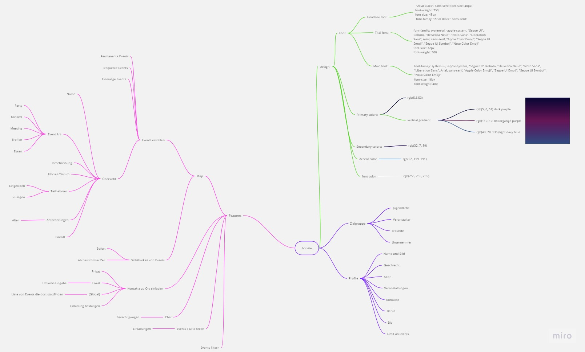
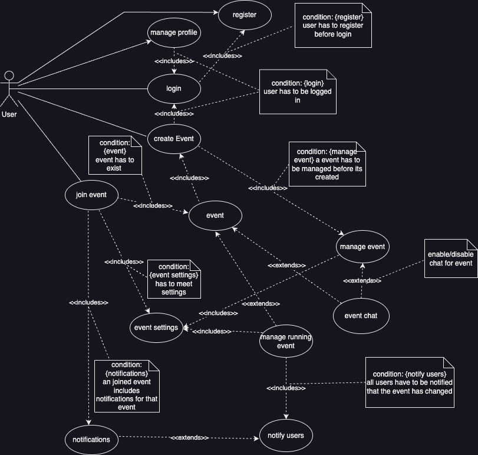
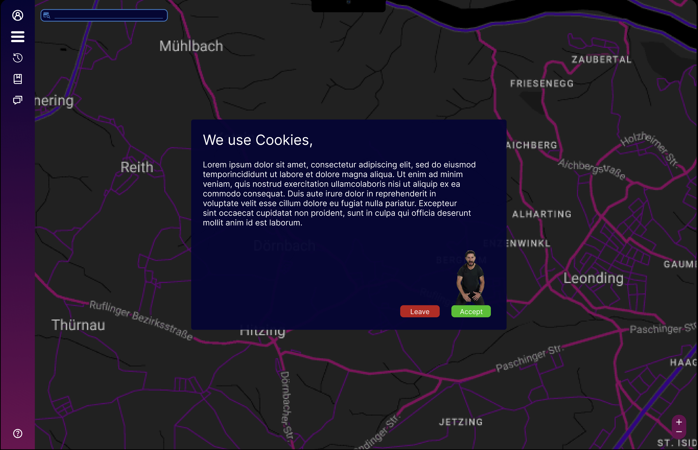

# Projektantrag - Hotvite
Lisa Wieshofer, Leo Oberndorfer, Moritz Bernhofer

# 1. Ausgangslage

### 1.1. Ist-Situation
> Zurzeit gibt es keine App, um Veranstaltungen im Freundeskreis oder Umfeld zu finden oder zu erstellen. Bis jetzt muss man Veranstaltung über Webseiten/TV/Radio ankündigen und Partys jeden einzelnen oder in einer Gruppe fragen.

### 1.2. Verbesserungspotenziale
> Da so eine App nicht existiert, ist es für manche Menschen schwer Veranstaltungen schnell und effizient zu finden.

# 2. Zielsetzung
> Wir wollen eine Plattform schaffen, die es jedem ermöglicht, ein Publikum zu finden, mit dem man die Zeit verbringen möchte. Aktuell müssen Veranstalter ihre Events online auf einer Website bekannt geben, Plakate aufhängen oder anderen Leuten davon berichten.

> Unsere App soll eine übersichtliche Karte von Orten in der Umgebung anzeigen, an denen Veranstaltungen stattfinden. Der Benutzer kann sich die Veranstaltungen in seiner Nähe anzeigen lassen und sich für diese anmelden. Er kann auch selber eine Veranstaltung erstellen und diese mit anderen teilen. Potenzielle Teilnehmer können sich auf Knopfdruck für Veranstaltungen anmelden und werden automatisch benachrichtigt, wenn sich etwas an der Veranstaltung ändert. Der Veranstalter kann die Teilnehmerzahl begrenzen und die Teilnehmerliste einsehen.

# 3. Chancen und Risiken
> Die App bietet innovative Funktionen, die es bisher in ähnlicher Form in anderen Apps nicht gibt, was das Potenzial für einen Erfolg hat. Durch die Möglichkeit, Events zu erstellen und mit anderen Nutzern zu teilen, kann die App das soziale Leben bereichern und die Vernetzung fördern. Durch das erstellen und finden von Events, erleichtert die App. Die App kann dazu beitragen, Events und Treffen effizienter zu organisieren und Planungsprozesse zu optimieren.

> Es besteht die Gefahr, dass die App von wenigen Menschen genutzt wird, was die Attraktivität für Nutzer und Event-Veranstalter verringert. Die Erfassung von Standortdaten birgt Datenschutzrisiken und erfordert robuste Sicherheitsmaßnahmen, um die Privatsphäre der Nutzer zu schützen. Die Möglichkeit zur Erstellung von Events und Profilen kann Missbrauch und Spam durch unerwünschte Nutzer fördern. 
Ein Risiko bei der Projektentwicklung ist, dass Google die API kostenpflichtig macht.

# 4. Planung
### 4.1
> Die App wird eine interaktive Karte haben, auf der Nutzer Events erstellen und sie angezeigten bekommen. Nutzer können Events definieren, indem sie Details wie Ort, Zeit und Art des Events angeben. Die erstellten Events werden auf der Karte angezeigt, damit andere Nutzer sie finden und daran teilnehmen können. Jeder Nutzer kann ein persönliches Profil erstellen, das Informationen und Präferenzen für Events enthält. Die App wird Events in einem bestimmten Umkreis(min. 15km, max. 100km) anzeigen, außer man ist mit diesem Nutzer befreundet, um die Relevanz für den Nutzer sicherzustellen.

### 4.2
> Phase 1:
> 1. Es wird eine interaktive Karte zur Verfügung gestellt
> 2. Man kann Events erstellen (an einem Standort).

> Phase 2:
> 1. Events können mit bestimmten Kriterien erstellt werden.
> 2. Die App wird Einstellungen zur Sichtbarkeit von Events bieten, damit Nutzer festlegen können, wer ihre Events sehen kann, um die Privatsphäre zu wahren.
> 3. Nutzer können Events nach verschiedenen Kriterien filtern, um genau die Events zu finden, die ihren Interessen entsprechen.

> Bonus:
> - Es werden alle Events in einem Radius von 15km bis 100km angezeigt.
> - Chat
> - Files können im Chat hochgeladen werden (max. 10 MB)
> - Emojis im Chat
> - Stylishe Events

# UCD Diagram

# GUI Mockup

Link zum Mockup: https://www.figma.com/community/file/1318324013071176549
